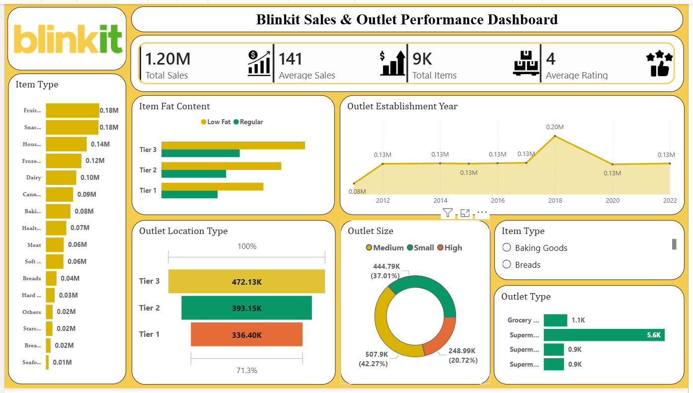

# BlinkIT-powerBI-Dashboard
Power BI dashboard analyzing BlinkIT sales, outlet performance, and product insights using Power Query and DAX.

## Dashboard Preview

## Project Overview

This Power BI dashboard analyzes BlinkIT grocery sales data to identify sales trends, outlet performance, product category performance, and customer ratings.

## Tools Used

* Power BI
* Power Query
* DAX
* Excel

## KPIs

* Total Sales: 1.20M
* Average Sales: 141
* Total Items: 8523
* Average Rating: 4

## Dashboard Features

* Sales by Item Type
* Sales by Outlet Location Type
* Sales by Outlet Size
* Sales by Outlet Type
* Outlet Establishment Year Analysis
* Item Fat Content Analysis

## Key Insights

* Tier 3 outlets generated the highest sales.
* Medium-sized outlets contributed the most revenue.
* Fruits and Snacks were among the top-selling categories.
* Outlets established in 2018 recorded the highest sales.

## Author

Om Waghmare
Aspiring Data Analys       
